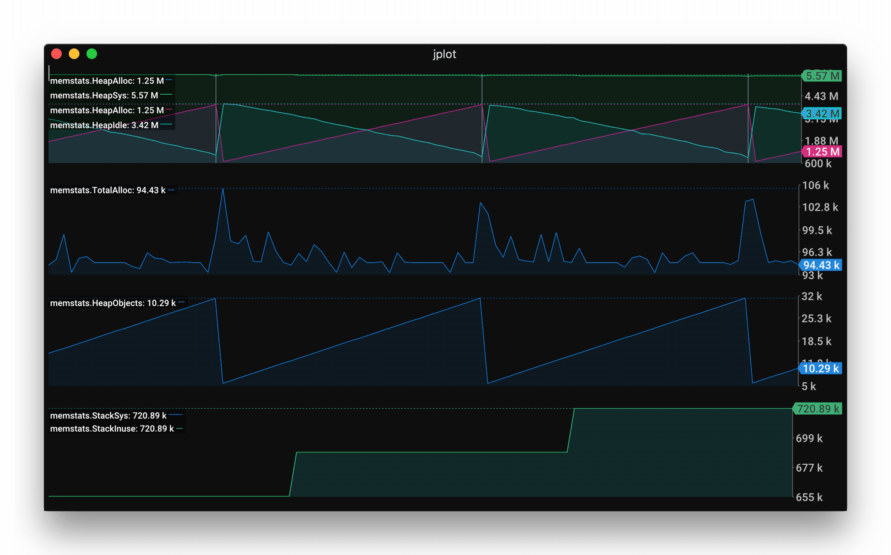
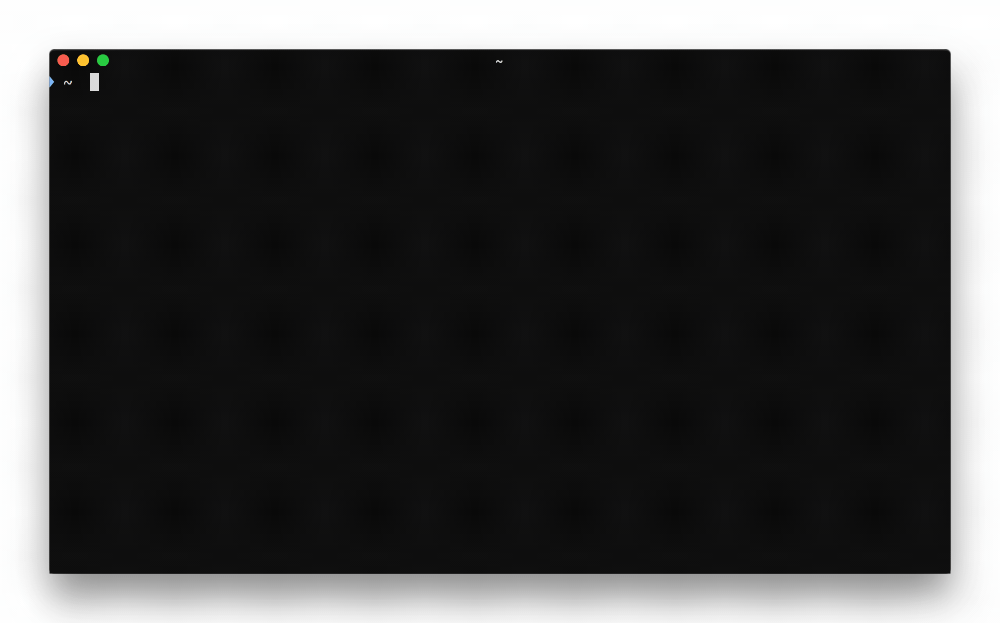
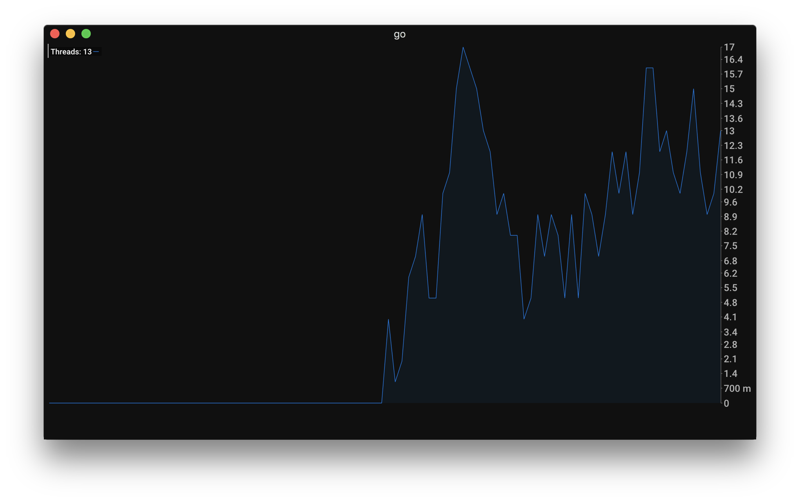
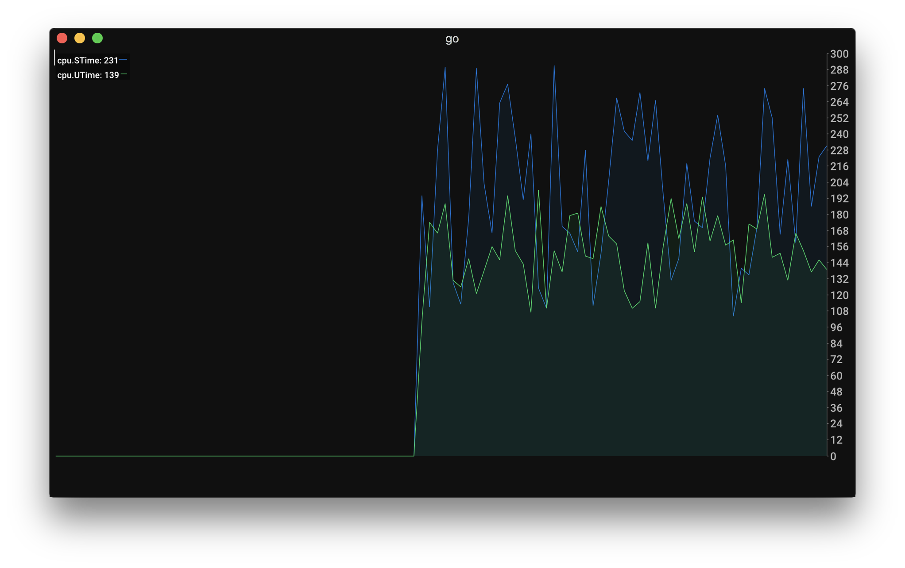
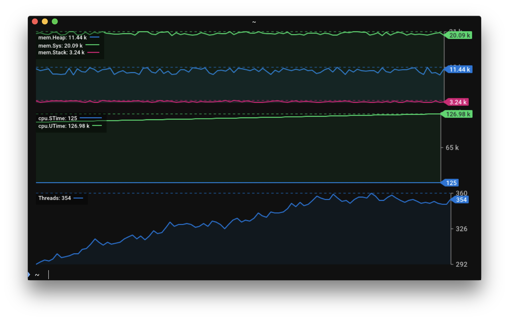
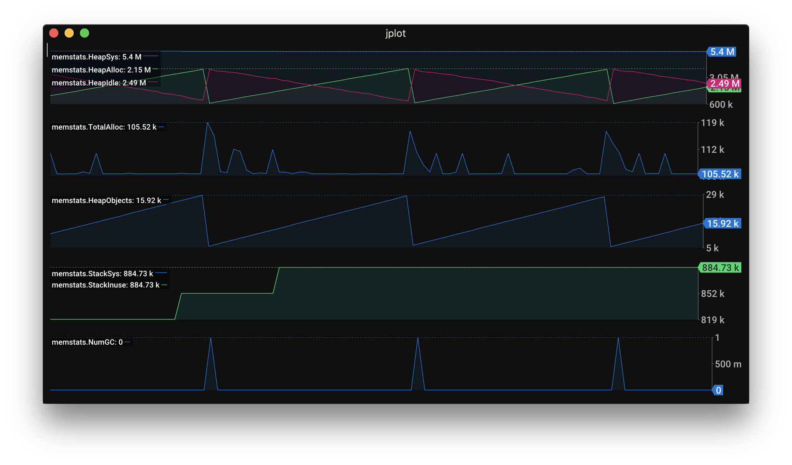
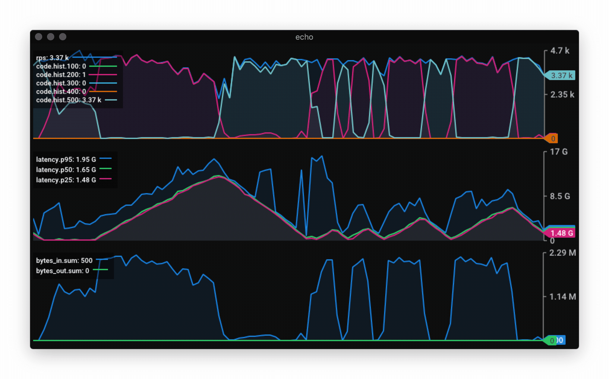

# jplot
[](https://raw.githubusercontent.com/rs/jplot/master/LICENSE) [](https://travis-ci.org/rs/jplot)

Jplot tracks expvar-like (JSON) metrics and plot their evolution over time right into your iTerm2 terminal.



Above capture is jplot monitoring a Go service's [expvar](https://golang.org/pkg/expvar/):

```
jplot --url http://:8080/debug/vars \
    memstats.HeapSys+memstats.HeapAlloc+memstats.HeapIdle+marker,counter:memstats.NumGC \
    counter:memstats.TotalAlloc \
    memstats.HeapObjects \
    memstats.StackSys+memstats.StackInuse
```

By default, jplot uses the full size of the terminal, but it is possible to limit the render to a few rows:



## Install

```
go get -u github.com/rs/jplot
```

This tool does only work with [iTerm2](https://www.iterm2.com).

## Usage

Given the following JSON output:

```
{
    "mem": {
        "Heap": 1234,
        "Sys": 4321,
        "Stack": 203
    },
    "cpu": {
        "STime": 123,
        "UTime":1234
    },
    "Threads": 2
}
```

You can graph the number of thread over time:

```
jplot --url http://:8080/debug/vars Threads
```



Or create a graph with both Utime and Stime growth rate on the same axis by using `+` between two field paths:

```
jplot --url http://:8080/debug/vars counter:cpu.STime+counter:cpu.UTime
```

Note: the `counter:` prefix instructs jplot to compute the difference between the values instead of showing their absolute value.




Or create several graphs by providing groups of fields as separate arguments; each argument creates a new graph:

```
jplot --url http://:8080/debug/vars mem.Heap+mem.Sys+mem.Stack counter:cpu.STime+cpu.UTime Threads
```



### Spec Syntax

Each positional arguments given to jplot create a stacked graph with the specified values. To reference the values, use [gojq](https://github.com/elgs/gojq) JSON query syntax. Several value paths can be referenced for the same graph by using the `+` character to separate them.

In addition, each value path can be prefixed with options separated from the path by a column. Several options can be used for the same command by separating them with a comma like so: `option1,option2:value.path`.

Supported options are:
* `counter`: Computes the difference with the last value. The value must increase monotonically.
* `marker`: When the value is none-zero, a vertical line is drawn.

## Recipes

### Memstats

Here is an example command to graph a Go program memstats:

```
jplot --url http://:8080/debug/vars \
    memstats.HeapSys+memstats.HeapAlloc+memstats.HeapIdle+marker,counter:memstats.NumGC \
    counter:memstats.TotalAlloc \
    memstats.HeapObjects \
    memstats.StackSys+memstats.StackInuse
```



### Vegeta

With the help of [jaggr](https://github.com/rs/jaggr] can be used to integrate [vegeta](https://github.com/tsenart/vegeta) with jplot as follow:

```
echo 'GET http://localhost:8080' | \
    vegeta attack -rate 5000 -workers 100 -duration 10m | vegeta dump | \
    jaggr @count=rps \
          hist\[100,200,300,400,500\]:code \
          p25,p50,p95:latency \
          sum:bytes_in \
          sum:bytes_out | \
    jplot rps+code.hist.100+code.hist.200+code.hist.300+code.hist.400+code.hist.500 \
          latency.p95+latency.p50+latency.p25 \
          bytes_in.sum+bytes_out.sum
```


